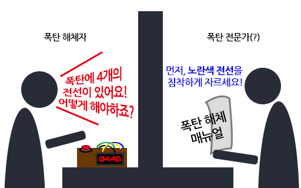
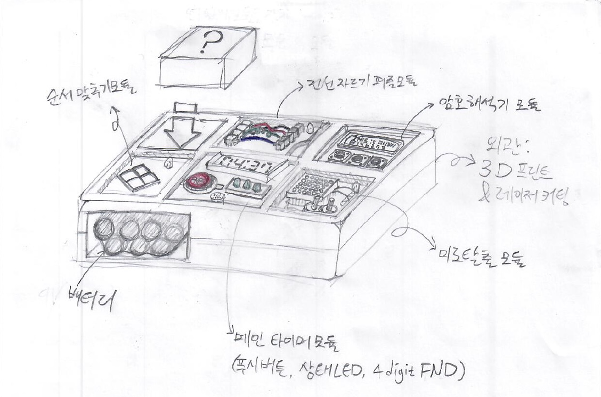

# 빵터지는 대화

https://gomjellie.github.io/bomb-talkie

## 개요

>  *"액션 영화 속 주인공은 종종 타이머가 째깍거리는 위험한 폭탄을 해제해야하는 상황에 맞닥뜨리곤 합니다. 주인공은 무전 너머의 폭탄 해제 전문가의 지령을 들으면서 아슬아슬하게 폭탄을 해제하는데 성공합니다."*

**저희는 박진감 넘치는 폭탄 해제를 현실에서 경험해보고 싶었습니다.** 그래서 저희 팀은 현실에서 폭탄(처럼 보이는 무언가)를 만들고, 폭탄을 해제하기 위한 룰을 만들어서, 보드게임의 형태로 제작하려합니다.

그리고 그 흥미진진한 게임을 메이커 페어의 사람들과 함께 체험해보고 싶습니다. 

## 게임 방법

먼저 게임에는 **2명**의 플레이어가 참여하고 각각에게 **폭탄**과 해체 방법이 담긴 **매뉴얼**이 주어집니다.

이제부터 **폭탄**을 가진 사람은 **폭탄 해체자**, **매뉴얼**을 가진 사람은 **폭탄 전문가**가 됩니다.

서로는 분리된 공간에 있게되며, 단지 **대화로만** 소통이 가능합니다.

> 게임 진행 예시

폭탄을 앞에 두고있는 **폭탄 해체자**와 폭탄 해체 매뉴얼을 갖고있는 **폭탄 전문가**가 협력하여 **대화**를 통해서 제한 시간내에 폭탄을 해체 하는 것이 이 게임의 주 목적입니다.

**폭탄 전문가**가 폭탄을 해제하는 방법을 전혀 몰랐던 사람이었다 해도 괜찮습니다. 글을 읽을 수만 있다면 누구나 그 방법을 바로 알 수 있도록 매뉴얼이 작성되어있거든요. 그저 **폭탄 해체자**가 자신 앞에 있는 폭탄에 대해 자세히 묘사만 해준다면, 그리고 **폭탄 전문가**가 잘 알아듣고 완벽한 해결 방법을 알려준다면, 폭탄을 해제하는 것은 그리 어렵지 않을 것입니다. *하지만, 제한시간내에  폭탄을 해체하지 못하는 경우, **폭탄해체자**는 무사하지 못할 것입니다.*

빠른 시간 내에 해체에 성공한 팀에게는 상품이 주어질지도...  

## 설계 및 제작 계획

> **폭탄은 아두이노,각종 입력장치, 3D프린팅, 레이저 커팅 등으로 구현하여  실제 폭탄과 같이 실감나는 경험을 제공할 것입니다.**

### 설계

> 작품 스케치

- 폭탄을 해제하는 과정에는 다양한 종류의 퍼즐들이 이용됩니다. 모든 퍼즐들을 풀어야만 폭탄이 해제됩니다.

- 각각의 퍼즐들은 모듈 형태로 되어 있습니다. 

- 타이머가 달린 메인 모듈은 남은 시간과, 다른 모듈의 퍼즐을 푸는 과정에서 실수를 한 횟수를 표시해줍니다. 

- 나머지 모듈들에는 저마다의 해결 방법이 있는 퍼즐이 있습니다. 

- 모듈들 속 퍼즐을 푸는 방법은 매뉴얼로 제공됩니다.

  

### 제작 계획

1. 모듈은 아두이노로 회로를 제작하고 코딩을 한뒤, 3D프린팅된 외관을 씌울 것입니다.
2. 최종적으로 제작한 모든 모듈들을 서류 가방 형태의 케이스에 조립하여 게임에 쓰일 폭탄을 만듭니다. 
3. 모듈 제작 과정에서 각 퍼즐의 해결법을 만들어두고, 모두 추합하여 책자 형태의 매뉴얼을 만들 예정입니다.
4. 매 게임마다 다른 경험을 줄 수 있도록, 모듈은 탈착식으로 제작하여 랜덤으로 배치할 예정입니다. 